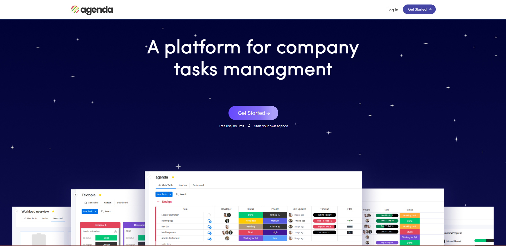
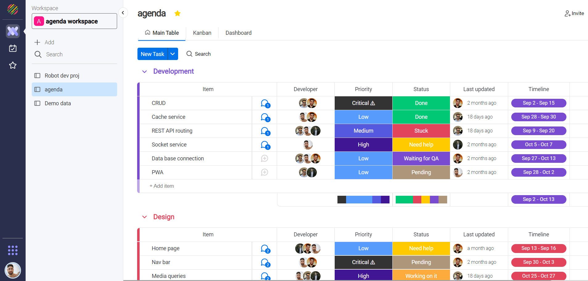
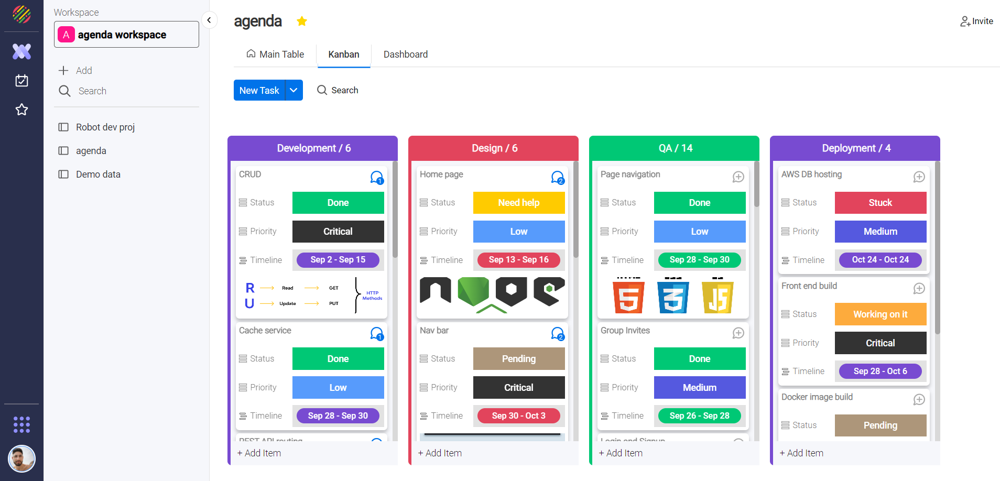
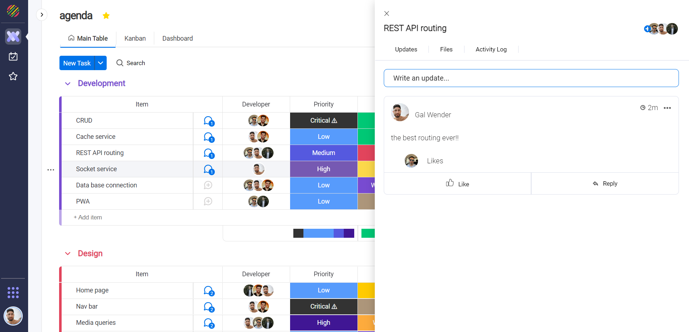

# agenda
task management platform where anyone can create the tools they need to run every aspect of their work.

# Installation
- Steps on how to install this project.
- Make sure to do this for both the frontend and backend repositories.

```
npm i 
npm start
```

# Gallery





# Credit/Acknowledgment
Tal Ben Atiya
Or Agami